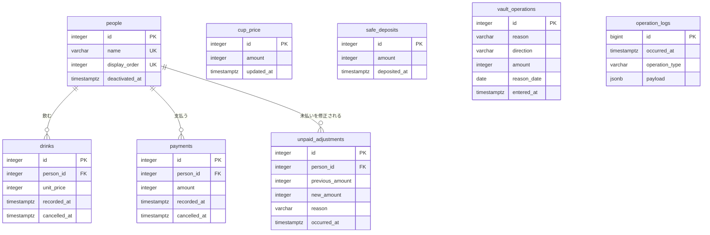

# 珈琲台帳（coffee-ledger） DB設計

> API のパスや画面の詳細は書かない（`api-design.md` / `ui-design.md`）。
> 機能固有テーブルはスキーマ `coffee_ledger` に置く。`public` にテーブルを置かない。

- スキーマ: `coffee_ledger`（すべてのテーブルをここに置く）
- 認証しないため、ユーザ・セッションの表とユーザIDの列は持たない（`rules/14-security.md`）。
- 残高（未払い代金、徴収済み金額、未徴収金額、金庫金額）は列として持たず、記録から計算する（`design.md`「業務ロジック」）。
- 日時は `timestamptz` で持ち、アプリが日本時間で書き込む。
- 金額はすべて円単位の `integer`。
- 記録は物理削除しない。取り消しは取り消し日時を入れて表す。
- テーブル定義は参考実装（`sample/coffee-ledger/backend/sql/`）と同じにする。参考実装の 3 ファイルに分かれた定義と重複した記述を、1 つの初期構築用 SQL にまとめる。

## ER図

`cup_price`、`safe_deposits`、`vault_operations`、`operation_logs` は他のテーブルと外部キーで結ばない。`operation_logs.payload` は対象の ID や名前を写しとして持つ（参照整合は持たない）。

## テーブル設計

### `coffee_ledger.people`

**目的**: 台帳の利用者（人）。REQ-002、REQ-012〜014。

| カラム | 型 | NULL | 既定値 | 説明 |
|--------|----|----|--------|------|
| id | integer | NOT NULL | IDENTITY（BY DEFAULT） | 主キー |
| name | varchar(100) | NOT NULL | | 名前。前後の空白を除いた値。1 文字以上 |
| display_order | integer | NOT NULL | | 表示順。1 以上。利用停止した人を含む全員で 1 から連番 |
| deactivated_at | timestamptz | NULL | | 利用停止した日時。NULL なら利用中 |

- 主キー: `id`
- 一意制約: `name`（`people_name_key`）、`display_order`（`people_display_order_key`）
- 検査制約: `char_length(name) >= 1`（`people_name_len`）、`display_order >= 1`（`people_display_order_pos`）
- 外部キー: なし

**インデックス**

| 名前 | 対象カラム | 種別 |
|------|------------|------|
| people_active_order_idx | display_order | B-tree（部分: `deactivated_at IS NULL`） |

### `coffee_ledger.cup_price`

**目的**: 一杯単価。常に 1 行（`id = 1`）だけを持つ。行が無ければ未登録。REQ-008。

| カラム | 型 | NULL | 既定値 | 説明 |
|--------|----|----|--------|------|
| id | integer | NOT NULL | | 主キー。常に 1 |
| amount | integer | NOT NULL | | 一杯単価（円）。1 以上 |
| updated_at | timestamptz | NOT NULL | | 登録・変更した日時 |

- 主キー: `id`
- 一意制約: なし
- 検査制約: `id = 1`（`cup_price_id_one`）、`amount >= 1`（`cup_price_amount_pos`）
- 外部キー: なし

**インデックス**

| 名前 | 対象カラム | 種別 |
|------|------------|------|
| なし（主キーのみ） | | |

### `coffee_ledger.drinks`

**目的**: 飲用の記録。記録時点の一杯単価を写して持つ。REQ-003、REQ-004、REQ-015。

| カラム | 型 | NULL | 既定値 | 説明 |
|--------|----|----|--------|------|
| id | integer | NOT NULL | IDENTITY（BY DEFAULT） | 主キー |
| person_id | integer | NOT NULL | | 飲んだ人 |
| unit_price | integer | NOT NULL | | 記録時点の一杯単価（円）。1 以上 |
| recorded_at | timestamptz | NOT NULL | | 記録した日時 |
| cancelled_at | timestamptz | NULL | | 取り消した日時。NULL なら有効 |

- 主キー: `id`
- 一意制約: なし
- 検査制約: `unit_price >= 1`（`drinks_unit_price_pos`）
- 外部キー: `person_id` → `coffee_ledger.people.id`（`drinks_person_fk`、ON DELETE RESTRICT、ON UPDATE RESTRICT）

**インデックス**

| 名前 | 対象カラム | 種別 |
|------|------------|------|
| drinks_person_recorded_idx | person_id, recorded_at DESC | B-tree |
| drinks_person_active_idx | person_id | B-tree（部分: `cancelled_at IS NULL`） |
| drinks_cancelled_idx | cancelled_at | B-tree（部分: `cancelled_at IS NOT NULL`） |

### `coffee_ledger.payments`

**目的**: 支払の記録。REQ-005、REQ-006、REQ-015。

| カラム | 型 | NULL | 既定値 | 説明 |
|--------|----|----|--------|------|
| id | integer | NOT NULL | IDENTITY（BY DEFAULT） | 主キー |
| person_id | integer | NOT NULL | | 支払った人 |
| amount | integer | NOT NULL | | 支払額（円）。1 以上 |
| recorded_at | timestamptz | NOT NULL | | 記録した日時。徴収済み金額の計算で、最後の金庫収納の日時と比べる |
| cancelled_at | timestamptz | NULL | | 取り消した日時。NULL なら有効 |

- 主キー: `id`
- 一意制約: なし
- 検査制約: `amount >= 1`（`payments_amount_pos`）
- 外部キー: `person_id` → `coffee_ledger.people.id`（`payments_person_fk`、ON DELETE RESTRICT、ON UPDATE RESTRICT）

**インデックス**

| 名前 | 対象カラム | 種別 |
|------|------------|------|
| payments_person_recorded_idx | person_id, recorded_at DESC | B-tree |
| payments_recorded_active_idx | recorded_at | B-tree（部分: `cancelled_at IS NULL`） |
| payments_person_active_idx | person_id | B-tree（部分: `cancelled_at IS NULL`） |
| payments_cancelled_idx | cancelled_at | B-tree（部分: `cancelled_at IS NOT NULL`） |

### `coffee_ledger.unpaid_adjustments`

**目的**: 未払いの修正の記録。修正前と修正後の額の差が、その人の未払い代金に加わる。REQ-016。

| カラム | 型 | NULL | 既定値 | 説明 |
|--------|----|----|--------|------|
| id | integer | NOT NULL | IDENTITY（BY DEFAULT） | 主キー |
| person_id | integer | NOT NULL | | 修正した人 |
| previous_amount | integer | NOT NULL | | 修正前の未払い代金（円）。0 以上 |
| new_amount | integer | NOT NULL | | 修正後の未払い代金（円）。0 以上。修正前と異なる |
| reason | varchar(200) | NOT NULL | | 事由。前後の空白を除いた値。1 文字以上 |
| occurred_at | timestamptz | NOT NULL | | 修正した日時 |

- 主キー: `id`
- 一意制約: なし
- 検査制約: `previous_amount >= 0`（`unpaid_adjustments_previous_nonneg`）、`new_amount >= 0`（`unpaid_adjustments_new_nonneg`）、`new_amount <> previous_amount`（`unpaid_adjustments_amount_changed`）、`char_length(reason) >= 1`（`unpaid_adjustments_reason_len`）
- 外部キー: `person_id` → `coffee_ledger.people.id`（`unpaid_adjustments_person_fk`、ON DELETE RESTRICT、ON UPDATE RESTRICT）

**インデックス**

| 名前 | 対象カラム | 種別 |
|------|------------|------|
| unpaid_adjustments_person_idx | person_id | B-tree |
| unpaid_adjustments_occurred_idx | occurred_at DESC, id DESC | B-tree |

### `coffee_ledger.safe_deposits`

**目的**: 金庫収納の記録。収納した時点の徴収済み金額の全額を持つ。REQ-010。

| カラム | 型 | NULL | 既定値 | 説明 |
|--------|----|----|--------|------|
| id | integer | NOT NULL | IDENTITY（BY DEFAULT） | 主キー |
| amount | integer | NOT NULL | | 収納額（円）。1 以上 |
| deposited_at | timestamptz | NOT NULL | | 収納した日時。この日時より後の支払が、次の徴収済み金額になる |

- 主キー: `id`
- 一意制約: なし
- 検査制約: `amount >= 1`（`safe_deposits_amount_pos`）
- 外部キー: なし

**インデックス**

| 名前 | 対象カラム | 種別 |
|------|------------|------|
| safe_deposits_deposited_idx | deposited_at DESC | B-tree |

### `coffee_ledger.vault_operations`

**目的**: 金庫操作（入金・出金）の記録。REQ-011。

| カラム | 型 | NULL | 既定値 | 説明 |
|--------|----|----|--------|------|
| id | integer | NOT NULL | IDENTITY（BY DEFAULT） | 主キー |
| reason | varchar(200) | NOT NULL | | 事由。前後の空白を除いた値。1 文字以上 |
| direction | varchar(16) | NOT NULL | | `deposit`（入金）または `withdrawal`（出金） |
| amount | integer | NOT NULL | | 金額（円）。1 以上 |
| reason_date | date | NOT NULL | | 事由の日付（利用者が入力） |
| entered_at | timestamptz | NOT NULL | | 記録した日時。集計の並び順はこの日時による |

- 主キー: `id`
- 一意制約: なし
- 検査制約: `char_length(reason) >= 1`（`vault_operations_reason_len`）、`direction IN ('deposit', 'withdrawal')`（`vault_operations_direction_check`）、`amount >= 1`（`vault_operations_amount_pos`）
- 外部キー: なし

**インデックス**

| 名前 | 対象カラム | 種別 |
|------|------------|------|
| vault_operations_entered_idx | entered_at DESC, id DESC | B-tree |

### `coffee_ledger.operation_logs`

**目的**: 台帳のデータを変えた操作の記録。業務の記録と同じトランザクションで書く。REQ-018。

| カラム | 型 | NULL | 既定値 | 説明 |
|--------|----|----|--------|------|
| id | bigint | NOT NULL | IDENTITY（BY DEFAULT） | 主キー |
| occurred_at | timestamptz | NOT NULL | | 操作した日時 |
| operation_type | varchar(64) | NOT NULL | | 操作の種類（下表） |
| payload | jsonb | NOT NULL | | 操作の内容（下表） |

- 主キー: `id`
- 一意制約: なし
- 検査制約: `operation_type` は下表の 12 種のいずれか（`operation_logs_type_check`）
- 外部キー: なし

**インデックス**

| 名前 | 対象カラム | 種別 |
|------|------------|------|
| operation_logs_occurred_idx | occurred_at DESC, id DESC | B-tree |

**操作の種類と `payload` の項目**

| operation_type | 操作 | payload の項目 |
|----------------|------|----------------|
| person_registered | 人の登録 | `person_id`, `name` |
| person_deactivated | 人の利用停止 | `person_id`, `name` |
| display_order_changed | 表示順の変更 | `person_ids`（新しい並びの人 ID の配列） |
| cup_price_registered | 一杯単価の登録 | `amount` |
| cup_price_updated | 一杯単価の変更 | `amount`, `previous_amount` |
| drink_recorded | 飲用の記録 | `person_id`, `name`, `drink_id`, `unit_price` |
| drink_cancelled | 飲用の取り消し | `person_id`, `name`, `drink_id`, `unit_price` |
| payment_recorded | 支払の記録 | `person_id`, `name`, `payment_id`, `amount` |
| payment_cancelled | 支払の取り消し | `person_id`, `name`, `payment_id`, `amount` |
| safe_deposited | 金庫収納 | `safe_deposit_id`, `amount` |
| vault_operated | 金庫操作 | `vault_operation_id`, `direction`, `amount`, `reason`, `reason_date`（`YYYY-MM-DD`） |
| unpaid_adjusted | 未払い修正 | `unpaid_adjustment_id`, `person_id`, `name`, `previous_amount`, `new_amount`, `reason` |

`name` は操作した時点の名前の写しである。

## SQL ファイル

`design.md`「DB の構築」に従い、`psql` で手動実行する。どちらも再実行しても壊れないように書く。

| 種類 | ファイル | 内容 |
|------|----------|------|
| 初期構築用 | `backend/sql/init/001_schema.sql` | `CREATE SCHEMA IF NOT EXISTS coffee_ledger` と、上記 8 テーブル・制約・インデックスの作成（`CREATE TABLE IF NOT EXISTS`、`CREATE INDEX IF NOT EXISTS`） |
| マイグレーション用 | `backend/sql/migrations/` | 初版の時点では無い。以後、テーブル定義を変えるときに `NNN_<内容>.sql` を追加する |

- 実行するユーザは `backend/.env` の接続ユーザ（開発では `tstuser`）とする。スキーマの所有者もこのユーザになる。
- テーブルの作成順は、外部キーの参照先を先にする（`people` → `drinks` / `payments` / `unpaid_adjustments`）。

## 承認

現在の状態: 承認済み

| 日時 | 状態 | 変更概要 |
|------|------|----------|
| 2026-09-24 14:25 | 未承認 | 初版 |
| 2026-09-24 14:27 | 承認済み | 初版を承認 |
