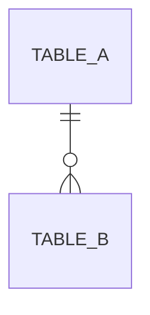

# <機能名> DB設計

> API のパスや画面の詳細は書かない（`api-design.md` / `ui-design.md`）。
> 機能固有テーブルはスキーマ `<feature_name>`（snake_case）に置く。`public` に業務テーブルを増やさない。

テーブルが無い場合は、以下すべてを「なし」と明記すること（節ごと削除しない）。

## ER図

## テーブル設計

### `<schema>.<table_name>`

**目的**: <このテーブルが何を表すか>

| カラム | 型 | NULL | 既定値 | 説明 |
|--------|----|----|--------|------|
| id | bigint | NOT NULL | | 主キー |
| user_id | bigint | NOT NULL | | `public.users` への外部キー |
| | | | | |

- 主キー: `id`
- 一意制約: <なければ「なし」>
- 外部キー: `user_id` → `public.users.id`

**インデックス**

| 名前 | 対象カラム | 種別 |
|------|------------|------|
| | | |

## 承認

現在の状態: 未承認

| 日時 | 状態 | 変更概要 |
|------|------|----------|
| | 未承認 | 初版 |
